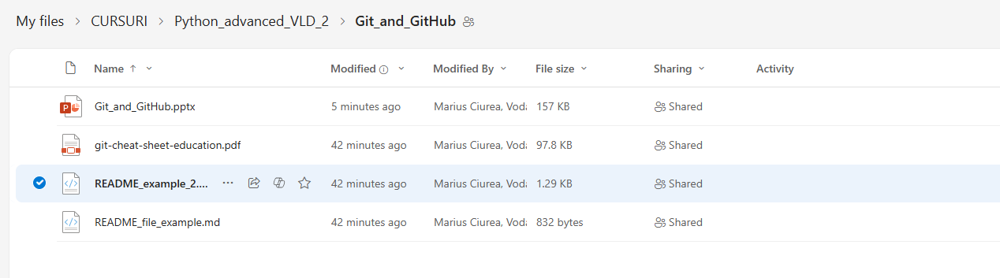

 # VNO RAN genAI ChatBot

Short intro about your project

## Table of contents
* [Overview](#overview)
* [Architecture](#architecture)
* [Prerequisites](#prerequisites)
* [Installation](#installation)
* [Usage](#usage)

## Overview
Describe your project

## Architecture


## Here is a table
Response:

|Site                    |	OMCH IP      | GSM IP        | UMTS IP| LTE IP        | Loop IP       |	IKE Peer    | eNB ID | gNB ID|
|------------------------|---------------|---------------|--------|---------------| ------------- | ------------|--------|-------|
|3613MA-Mall_Baneasa-GL  | 10.138.35.194 | 10.47.158.106 | False  |	10.137.34.110 |	10.47.114.159 | SEGW_VDF_BU | 936131 | False |


## Prerequisites
- OpenAI API key

## Installation
1. **Clone the Repository**
   ```bash
   git clone https://github.vodafone.com/VFDE-VNO-Digital/poc_vno_ran_genai_agent
   ```

2. **Install Dependencies**
   ```bash
   pip install -r requirements.txt
   ```
3. **Environment Setup**
   
    Create a `.env` file with the following credentials:
   ```
   OPENAI_API_KEY=your_openai_key
   ```
## Usage
**Start the Application**
   ```python
   streamlit run main_homepage.py
   ```

## Code example
```python
import math

print(math.sqrt(16))
```